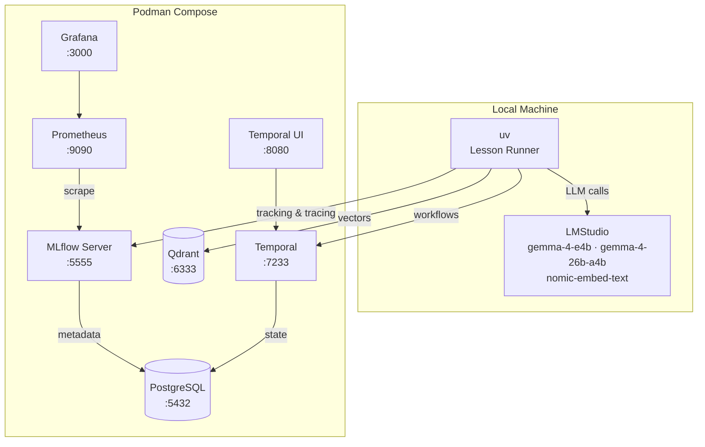

# MLFlow Tutorial: From LLMs to AI Agents

[](https://www.python.org/downloads/)
[](https://mlflow.org)
[](#license)
[](#course-structure)

> A comprehensive, three-level hands-on tutorial for MLFlow — from model tracking through production AI agent evaluation.

Learn MLflow by building. Each lesson is a standalone Python project you can run immediately. The tutorial emphasizes **LLMs and AI agents** — tracking experiments, evaluating model quality, tracing agent behavior, and shipping to production — all running locally with LMStudio (no API costs).

## Features

- **42 self-contained lessons** across 3 domain-based levels with working code
- **Zero API costs** — all LLM inference runs locally via LMStudio
- **Full infrastructure included** — one `podman compose up` starts everything
- **Agent evaluation focus** — LangChain, LangGraph, Claude Agent SDK, DeepAgents
- **Production patterns** — Grafana dashboards, CI/CD quality gates, trace sampling
- **Each lesson runs independently** — `uv sync && uv run python main.py`

## Architecture



## Course Structure

| Level | Focus | Modules | Lessons | Time |
| ------- | ------- | --------- | --------- | ------ |
| **Level 1 — Models** | Everything about models/LLMs end-to-end | 7 | 18 | ~16 hours |
| **Level 2 — AI Agents** | Agent frameworks, evaluation, benchmarking | 4 | 13 | ~19.5 hours |
| **Level 3 — Advanced** | Production patterns, infrastructure, capstones | 4 | 11 | ~19 hours |

See [syllabus.md](./syllabus.md) for the full syllabus with lesson descriptions and deliverables.

### Level 1 — Models

| Module | Lessons | Topics |
| -------- | --------- | -------- |
| M1 Tracking | 3 | Tracking fundamentals, search/query/MlflowClient, advanced patterns |
| M2 Tracing | 2 | Auto and manual tracing, trace analysis |
| M3 Models & Registry | 3 | Models/flavors/signatures, custom PyFunc, registry workflows |
| M4 Evaluation | 4 | Evaluation fundamentals, GenAI/custom metrics, RAG evaluation, datasets/human-in-loop |
| M5 Prompt Engineering | 2 | Prompt registry/management, prompt optimization |
| M6 Deployment & Gateway | 3 | Model serving, batch prediction, AI gateway |
| M7 Fine-Tuning | 1 | HuggingFace Transformers |

### Level 2 — AI Agents

| Module | Lessons | Topics |
| -------- | --------- | -------- |
| M1 Agent Frameworks | 3 | LangChain agents, LangGraph agents, multi-agent systems |
| M2 Custom Integrations | 2 | Claude Agent SDK, DeepAgents |
| M3 Agent Evaluation | 5 | Agent testing, quality metrics, architecture comparison, optimization, evaluation pipeline |
| M4 Agent Benchmarks | 3 | SWE-Bench, GAIA, custom domain-specific benchmark |

### Level 3 — Advanced

| Module | Lessons | Topics |
| -------- | --------- | -------- |
| M1 Production | 4 | Production tracing, Grafana dashboards, feedback loops, CI/CD |
| M2 Advanced Tracing | 2 | OpenTelemetry export, Temporal workflow tracing |
| M3 Extensibility | 3 | Custom autolog, plugins, enterprise data management |
| M4 Capstones | 2 | Production AI agent platform, cross-framework benchmark |

## Quick Start

### Prerequisites

- Python 3.10+
- [uv](https://docs.astral.sh/uv/) package manager
- [Podman](https://podman.io/) + [Podman Compose](https://github.com/containers/podman-compose)
- [LMStudio](https://lmstudio.ai/) installed natively (for Apple Silicon GPU access)

### 1. Start Podman machine

```bash
podman machine init
podman machine start
```

### 2. Load LMStudio models

```bash
lms load google/gemma-4-e4b           # Small 4B model (Level 1, fast tasks)
lms load google/gemma-4-26b-a4b       # Large 26B MoE model (Level 2-3, agents, judges)
# Also load: text-embedding-nomic-embed-text-v1.5 for RAG lessons
lms server start
```

### 3. Start all infrastructure

```bash
cd infra
podman compose up -d
```

### 4. Run your first lesson

```bash
cd tutorial/level_1_models/M1_tracking/1_tracking_fundamentals
uv sync
uv run python main.py
```

## Configuration

### Services

| Service | URL | Notes |
| --------- | ----- | ------- |
| MLflow UI | <http://localhost:5555> | Tracking, models, traces |
| LMStudio | <http://localhost:1234> | OpenAI-compatible API |
| Temporal UI | <http://localhost:8080> | Workflow orchestration |
| Qdrant | <http://localhost:6333/dashboard> | Vector database |
| Grafana | <http://localhost:3000> | Dashboards (admin/admin) |
| Prometheus | <http://localhost:9090> | Metrics collection |
| PostgreSQL | localhost:5432 | MLflow + Temporal backend |

### LLM Models

| Model | Size | Use Case |
| ------- | ------ | ---------- |
| `google/gemma-4-e4b` | 4B | Level 1 lessons, fast tasks, basic examples |
| `google/gemma-4-26b-a4b` | 26B MoE | Level 2-3, agents, LLM-as-judge |
| `text-embedding-nomic-embed-text-v1.5` | 137M | Embeddings for RAG and vector DB |

### Infrastructure Management

```bash
cd infra
podman compose up -d      # Start all services
podman compose down        # Stop (preserves data)
podman compose down -v     # Stop and wipe all data
```

## Project Structure

```text
syllabus.md                        # Full syllabus -- source of truth
infra/                             # All infrastructure (Podman Compose)
  compose.yml                      #   Single file to start everything
tutorial/
  level_1_models/                  # Models -- every MLflow feature end-to-end
    M1_tracking/                   #   Fundamentals, search/query, advanced patterns
    M2_tracing/                    #   Auto/manual tracing, trace analysis
    M3_models_registry/            #   Flavors, custom PyFunc, registry workflows
    M4_evaluation/                 #   Fundamentals, then offline and online
      1_fundamentals/              #     What evaluation is, and how to run one
      2_offline/                   #     GenAI metrics, RAG, datasets
      3_online/                    #     Scoring sampled live traffic
    M5_prompt_registry/            #   Prompt registry, versioning, A/B testing
    M6_deployment_gateway/         #   Serving, batch prediction, AI gateway
    M7_optimization/               #   Prompt optimization, fine-tuning
  level_2_agents/                  # AI Agents -- frameworks, eval, optimization
    M1_agent_frameworks/           #   LangChain/LangGraph, DeepAgents, Claude Agent SDK
    M2_agent_evaluation/           #   Three groups, by what the evaluation is
      1_instruments/               #     Dataset, judges, metrics -- feed both modes
      2_offline/                   #     Comparison, gates, and benchmarks
      3_online/                    #     Registered judge on sampled live traces
    M3_agent_optimization/         #   Instructions, configuration, benchmarks
  level_3_advanced/                # Advanced -- production, infrastructure
    M1_production/                 #   Tracing, Grafana, feedback, CI/CD
    M2_advanced_tracing/           #   OpenTelemetry, Temporal
    M3_extensibility/              #   Custom autolog, plugins, enterprise
    M4_capstones/                  #   Full production projects
```

Each lesson directory contains:

```text
N_lesson_name/
  pyproject.toml    # uv project with dependencies
  main.py           # Working lesson code
  README.md         # Guide with explanation, steps, expected output
  .gitignore        # Ignores .venv, __pycache__, mlruns, mlartifacts
```

## Technical Stack

| Category | Technology |
| ---------- | ------------ |
| ML Platform | MLflow 2.x+ |
| LLM Inference | LMStudio (local, OpenAI-compatible API) |
| Agent Frameworks | LangChain v1.0+, LangGraph, Claude Agent SDK, DeepAgents |
| Vector Database | Qdrant |
| Workflow Orchestration | Temporal.io |
| Monitoring | Grafana + Prometheus |
| Database | PostgreSQL |
| Container Runtime | Podman + Podman Compose |
| Package Manager | uv |

## Contributing

Contributions are welcome! Each lesson is self-contained, making it straightforward to add or improve individual lessons.

1. Fork the repository
2. Create your feature branch (`git checkout -b feature/improve-lesson`)
3. Ensure the lesson runs: `uv sync && uv run python main.py`
4. Commit your changes (`git commit -m 'Improve L1-M4.2.1 evaluation lesson'`)
5. Push to the branch (`git push origin feature/improve-lesson`)
6. Open a Pull Request

## License

This project is licensed under the MIT License.
