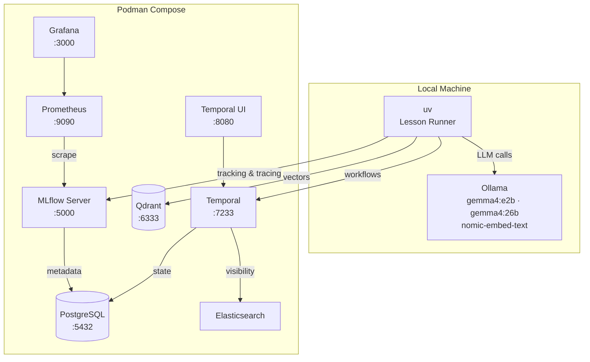

# MLFlow Tutorial: From LLMs to AI Agents

[](https://www.python.org/downloads/)
[](https://mlflow.org)
[](#license)
[](#course-structure)

> A comprehensive, three-level hands-on tutorial for MLFlow — from platform basics through production AI agent evaluation.

Learn MLflow by building. Each lesson is a standalone Python project you can run immediately. The tutorial emphasizes **LLMs and AI agents** — tracking experiments, evaluating model quality, tracing agent behavior, and shipping to production — all running locally with Ollama (no API costs).

## Features

- **67 self-contained lessons** across 3 progressive levels with working code
- **Zero API costs** — all LLM inference runs locally via Ollama
- **Full infrastructure included** — one `podman compose up` starts everything
- **Agent evaluation focus** — LangChain, LangGraph, Claude Agent SDK, Codex SDK, DeepAgents
- **Production patterns** — Grafana dashboards, CI/CD quality gates, trace sampling
- **Each lesson runs independently** — `uv sync && uv run python main.py`

## Architecture



## Course Structure

| Level | Focus | Modules | Lessons | Time |
|-------|-------|---------|---------|------|
| **Level 1 — Essentials** | Breadth: every major MLflow feature | 10 | 22 | ~10-12 hours |
| **Level 2 — Practitioner** | Depth: real-world projects | 9 | 26 | ~25-30 hours |
| **Level 3 — Expert** | Mastery: production agent evaluation | 5 | 19 | ~25-35 hours |

See [syllabus.md](./syllabus.md) for the full syllabus with lesson descriptions and deliverables.

### Level 1 — Essentials

| Module | Lessons | Topics |
|--------|---------|--------|
| M1 Tracking | 4 | First run, tracking basics, search API, system metrics |
| M2 Models & Registry | 3 | Model flavors, registry, PyFunc |
| M3 Autologging | 2 | Traditional ML, LLM/GenAI |
| M4 Evaluation | 3 | ML eval, LLM eval, LLM-as-judge |
| M5 Tracing | 2 | Auto tracing, manual tracing |
| M6 GenAI Features | 3 | Prompt registry, scorers/judges, datasets |
| M7 Data & Datasets | 1 | Dataset logging and lineage |
| M8 Deployment | 2 | Model serving, AI Gateway |
| M9 Projects | 1 | MLflow Projects |
| M10 Auth | 1 | Authentication and permissions |

### Level 2 — Practitioner

| Module | Lessons | Topics |
|--------|---------|--------|
| M1 Advanced Tracking | 4 | Nested runs, async logging, artifacts, MlflowClient |
| M2 Advanced Models | 3 | Signatures, custom PyFunc, registry workflows |
| M3 Deep Evaluation | 4 | Custom metrics, RAG eval, GenAI framework, human-in-loop |
| M4 Advanced Tracing | 4 | LangGraph, Temporal, OpenTelemetry, trace analysis |
| M5 Agent Observability | 3 | LangChain agents, LangGraph agents, multi-agent systems |
| M6 Prompt Engineering | 2 | Prompt management, prompt optimization |
| M7 AI Gateway | 1 | Gateway routing and configuration |
| M8 Deployment | 2 | Serving deep dive, batch prediction |
| M9 Framework Integrations | 3 | PyTorch, HuggingFace, Sentence Transformers |

### Level 3 — Expert

| Module | Lessons | Topics |
|--------|---------|--------|
| M1 Agent Evaluation | 5 | Testing, quality metrics, architecture comparison, optimization, pipelines |
| M2 Custom Integrations | 4 | Claude Agent SDK, Codex SDK, DeepAgents, custom autolog |
| M3 Production | 4 | Production tracing, Grafana dashboards, feedback loops, CI/CD |
| M4 Advanced Features | 4 | Plugins, enterprise, MCP, data management |
| M5 Capstones | 2 | Full agent platform, cross-framework benchmark |

## Quick Start

### Prerequisites

- Python 3.10+
- [uv](https://docs.astral.sh/uv/) package manager
- [Podman](https://podman.io/) + [Podman Compose](https://github.com/containers/podman-compose)
- [Ollama](https://ollama.ai/) installed natively (for Apple Silicon GPU access)

### 1. Start Podman machine

```bash
podman machine init
podman machine start
```

### 2. Pull Ollama models

```bash
ollama pull gemma4:e2b          # Small 2B model (Level 1, fast tasks)
ollama pull gemma4:26b          # Large MoE model (Level 2-3, agents, judges)
ollama pull nomic-embed-text    # Embedding model (RAG / vector DB)
```

### 3. Start all infrastructure

```bash
cd infra
podman compose up -d
```

### 4. Run your first lesson

```bash
cd tutorial/level_1/M1_tracking/1_first_run
uv sync
uv run python main.py
```

## Configuration

### Services

| Service | URL | Notes |
|---------|-----|-------|
| MLflow UI | http://localhost:5000 | Tracking, models, traces |
| Temporal UI | http://localhost:8080 | Workflow orchestration |
| Qdrant | http://localhost:6333/dashboard | Vector database |
| Grafana | http://localhost:3000 | Dashboards (admin/admin) |
| Prometheus | http://localhost:9090 | Metrics collection |
| PostgreSQL | localhost:5432 | MLflow + Temporal backend |
| Ollama | localhost:11434 | Runs natively, not in Podman |

### LLM Models

| Model | Size | Use Case |
|-------|------|----------|
| `gemma4:e2b` | 2B | Level 1 lessons, fast tasks, basic examples |
| `gemma4:26b` | 26B MoE | Level 2-3, agents, LLM-as-judge |
| `nomic-embed-text` | 137M | Embeddings for RAG and vector DB |

### Infrastructure Management

```bash
cd infra
podman compose up -d      # Start all services
podman compose down        # Stop (preserves data)
podman compose down -v     # Stop and wipe all data
```

## Project Structure

```
syllabus.md                  # Full syllabus — source of truth
infra/                       # All infrastructure (Podman Compose)
  compose.yml                #   Single file to start everything
  mlflow/                    #   MLflow Dockerfile
  temporal/                  #   Temporal config
  grafana/                   #   Grafana provisioning
  prometheus/                #   Prometheus config
  postgres/                  #   PostgreSQL init script
tutorial/
  level_1/                   # Essentials — breadth across all features
    M1_tracking/             #   First run, tracking basics, search, system metrics
    M2_models_registry/      #   Models, flavors, registry, PyFunc
    M3_tracing/              #   Autologging (auto-tracing) and manual tracing
    M4_evaluation/           #   LLM eval basics, LLM-as-judge
    M5_genai_features/       #   Prompts, scorers, judges, datasets
    M6_data_datasets/        #   Dataset logging and lineage
    M7_deployment/           #   Model serving, AI Gateway
    M8_auth/                 #   Authentication and permissions
  level_2/                   # Practitioner — depth in each area
    M1_advanced_tracking/    #   Nested runs, async, artifacts, client API
    M2_advanced_models/      #   Signatures, custom PyFunc, registry workflows
    M3_deep_evaluation/      #   Custom metrics, RAG eval, GenAI framework
    M4_advanced_tracing/     #   LangGraph, Temporal, OpenTelemetry
    M5_agent_observability/  #   LangChain/LangGraph agents, multi-agent
    M6_prompt_engineering/   #   Prompt management and optimization
    M7_ai_gateway/           #   Gateway routing and configuration
    M8_deployment/           #   Serving deep dive, batch prediction
    M9_framework_integrations/ # PyTorch, HuggingFace, Sentence Transformers
  level_3/                   # Expert — mastery and production
    M1_agent_evaluation/     #   Testing, metrics, comparison, optimization
    M2_custom_integrations/  #   Claude SDK, Codex SDK, DeepAgents, autolog
    M3_production/           #   Tracing at scale, Grafana, CI/CD
    M4_advanced_features/    #   Plugins, enterprise, MCP, data management
    M5_capstones/            #   Full production projects
```

Each lesson directory contains:

```
N_lesson_name/
  pyproject.toml    # uv project with dependencies
  main.py           # Working lesson code
  README.md         # Guide with explanation, steps, expected output
  .gitignore        # Ignores .venv, __pycache__, mlruns, mlartifacts
```

## Technical Stack

| Category | Technology |
|----------|------------|
| ML Platform | MLflow 2.x+ |
| LLM Inference | Ollama (local, zero cost) |
| Agent Frameworks | LangChain v1.0+, LangGraph, Claude Agent SDK, Codex SDK, DeepAgents |
| Traditional ML | scikit-learn, XGBoost, PyTorch, HuggingFace Transformers |
| Vector Database | Qdrant |
| Workflow Orchestration | Temporal.io |
| Monitoring | Grafana + Prometheus |
| Database | PostgreSQL |
| Container Runtime | Podman + Podman Compose |
| Package Manager | uv |

## Contributing

Contributions are welcome! Each lesson is self-contained, making it straightforward to add or improve individual lessons.

1. Fork the repository
2. Create your feature branch (`git checkout -b feature/improve-lesson`)
3. Ensure the lesson runs: `uv sync && uv run python main.py`
4. Commit your changes (`git commit -m 'Improve L1-M4.2 LLM eval lesson'`)
5. Push to the branch (`git push origin feature/improve-lesson`)
6. Open a Pull Request

## License

This project is licensed under the MIT License.
