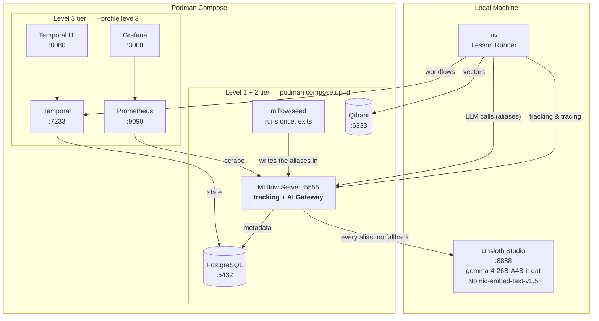

# MLFlow Tutorial: From LLMs to AI Agents

[](https://www.python.org/downloads/)
[](https://mlflow.org)
[](#license)
[](#course-structure)

> A comprehensive, three-level hands-on tutorial for MLFlow — from model tracking through production AI agent evaluation.

Learn MLflow by building. Each lesson is a standalone Python project you can run immediately. The tutorial emphasizes **LLMs and AI agents** — tracking experiments, evaluating model quality, tracing agent behavior, and shipping to production — all running locally with Unsloth Studio (no API costs).

## Features

- **60 self-contained lessons** across 3 domain-based levels with working code
- **Zero API costs** — all LLM inference runs locally via Unsloth Studio
- **Full infrastructure included** — one `podman compose up` starts what Level 1 and 2 need; `--profile level3` adds the rest
- **Agent evaluation focus** — LangChain, LangGraph, Claude Agent SDK, DeepAgents
- **Production patterns** — Grafana dashboards, CI/CD quality gates, trace sampling
- **Each lesson runs independently** — `uv sync && uv run python main.py`, except
  the few lessons that ship more than one script; their README names them

## Architecture



**There is one gateway and it is the MLflow server.** A lesson names an alias
(`gemma-chat`, `gemma-judge`, `gemma-agent`) and posts to
`http://127.0.0.1:5555/gateway/mlflow/v1` — the same server it logs runs and
traces to. A server-side judge needs no separate wiring at all: it names
`gateway:/gemma-judge`, which the server already holds.

## Course Structure

| Level | Focus | Modules | Lessons | Time |
| ------- | ------- | --------- | --------- | ------ |
| **Level 1 — Models** | Everything about models/LLMs end-to-end | 7 | 18 | ~16.25 hours |
| **Level 2 — AI Agents** | Agent frameworks, evaluation, benchmarking | 3 | 30 | ~35.5 hours |
| **Level 3 — Advanced** | Production patterns, infrastructure, capstones | 4 | 11 | ~19 hours |

See [syllabus.md](./syllabus.md) for the full syllabus with lesson descriptions and deliverables.

### Level 1 — Models

| Module | Lessons | Topics |
| -------- | --------- | -------- |
| M1 Tracking | 3 | Tracking fundamentals, search/query/MlflowClient, advanced patterns |
| M2 Tracing | 2 | Auto and manual tracing, trace analysis |
| M3 Models & Registry | 3 | Models/flavors/signatures, custom PyFunc, registry workflows |
| M4 Evaluation | 5 | Evaluation fundamentals, GenAI/custom metrics, RAG evaluation, datasets/human-in-loop, online scoring |
| M5 Prompt Registry | 1 | Prompt registry, versioning and management |
| M6 Deployment & Gateway | 3 | Model serving, batch prediction, AI gateway |
| M7 Optimization | 2 | Model optimization, fine-tuning with HuggingFace Transformers |

### Level 2 — AI Agents

| Module | Lessons | Topics |
| -------- | --------- | -------- |
| M1 Agent Frameworks | 3 | LangChain/LangGraph, DeepAgents, Claude Agent SDK |
| M2 Agent Evaluation | 24 | Split by SCOPE throughout: instruments (turn, conversation, dataset store), offline (turn gates + benchmarks, conversation gates + multi-turn benchmark), online (turn, conversation) |
| M3 Agent Optimization | 3 | Prompt/instruction, configuration, benchmark optimization |

### Level 3 — Advanced

| Module | Lessons | Topics |
| -------- | --------- | -------- |
| M1 Production | 4 | Production tracing, Grafana dashboards, feedback loops, CI/CD |
| M2 Advanced Tracing | 2 | OpenTelemetry export, Temporal workflow tracing |
| M3 Extensibility | 3 | Custom autolog, plugins, enterprise data management |
| M4 Capstones | 2 | Production AI agent platform, cross-framework benchmark |

## Quick Start

### Prerequisites

- Python 3.10+
- [uv](https://docs.astral.sh/uv/) package manager
- [Podman](https://podman.io/) + [Podman Compose](https://github.com/containers/podman-compose)
- [Unsloth Studio](https://unsloth.ai/) installed natively (for Apple Silicon GPU access)

### 1. Start Podman machine

```bash
podman machine init
podman machine start
```

### 2. Set up Unsloth Studio

Start it, then set two things in **Settings → API**:

1. **Model auto-switch: ON.** Unsloth holds one model at a time. With this off,
   every alias except the currently loaded model fails with
   `400 ... 'Switch model by request' is off`. With it on, a swap costs 4–14 s
   and needs no intervention.
2. **Copy the API key.** Unsloth requires one on every route, `/v1/models`
   included. Export it as `UNSLOTH_API_KEY` before starting the stack — the
   gateway seeder reads it from the environment, and with it blank the seeder
   skips every local alias rather than building endpoints that 401 later.

Download the three models the aliases name:

```text
unsloth/gemma-4-26B-A4B-it-qat-GGUF                gemma-chat, gemma-judge, gemma-agent
unsloth/gemma-4-31B-it-qat-GGUF                    gemma-31b-local
second-state/Nomic-embed-text-v1.5-Embedding-GGUF  nomic-embed, text-embedding-3-small
```

Leave **auto_download_model OFF**: with it on, a typo in a model id becomes a
multi-gigabyte download rather than an error.

### 3. Start the infrastructure

```bash
cd infra
podman compose up -d                     # Level 1 + Level 2: MLflow, Qdrant, PostgreSQL
podman compose --profile level3 up -d    # Level 3: adds Temporal, Prometheus, Grafana
```

Level 1 and 2 lessons only talk to MLflow, which is also the gateway, so the
default tier leaves Temporal (four containers plus an Elasticsearch JVM),
Prometheus and Grafana out. Add them when you reach Level 3 — the second
command is additive and shares the same volumes. Details, including the
`COMPOSE_PROFILES` switch that makes the profile sticky, are in
[infra/README.md](./infra/README.md).

### 4. Run your first lesson

```bash
cd tutorial/level_1_models/M1_tracking/1_tracking_fundamentals
uv sync
uv run python main.py
```

## Configuration

### Services

| Service | Tier | URL | Notes |
| --------- | ------ | ----- | ------- |
| MLflow UI | L1+ | <http://localhost:5555> | Tracking, models, traces |
| MLflow AI Gateway | L1+ | <http://localhost:5555/gateway/mlflow/v1> | **Every lesson's LLM entry point** — the same server |
| Unsloth Studio | host | <http://127.0.0.1:8888> | Serves the local models *behind* the gateway |
| Qdrant | L1+ | <http://localhost:6333/dashboard> | Vector database |
| PostgreSQL | L1+ | localhost:5432 | MLflow + Temporal backend |
| Temporal UI | L3 | <http://localhost:8080> | Workflow orchestration |
| Grafana | L3 | <http://localhost:3000> | Dashboards (admin/admin) |
| Prometheus | L3 | <http://localhost:9090> | Metrics collection |

### LLM Models

Lessons name an **alias**, never a model. The mapping and the fallback order
live in `infra/mlflow/gateway/seed_gateway.py` — change a model there, run
`podman compose run --rm mlflow-seed --reset --prune`, and every lesson follows
with no lesson edited.

| Alias | Resolves to | Use Case |
| ------- | ------ | ---------- |
| `gemma-chat` | Unsloth `gemma-4-26B-A4B-it-qat` | The lesson's own LLM call — the thing under observation |
| `gemma-judge` | Unsloth `gemma-4-26B-A4B-it-qat` | LLM-as-judge, scorers, simulators |
| `gemma-agent` | Unsloth `gemma-4-26B-A4B-it-qat` | Agent loops and tool calling |
| `gemma-tight` | same model | Context-overflow demos. The 7168-token guard LiteLLM enforced has no equivalent here, so overflow now fails at the model |
| `gemma-31b-local` | Unsloth `gemma-4-31B-it-qat` | The denser local model |
| `nomic-embed` | Unsloth `Nomic-embed-text-v1.5` | Embeddings for RAG and vector DB |
| `text-embedding-3-small` | Unsloth `Nomic-embed-text-v1.5` | Same local model as `nomic-embed`. The name is fixed by MLflow — its judge aligner requests it by that literal string |
| `gpt-4.1-mini` | Unsloth `gemma-4-26B-A4B-it-qat` | MLflow's aligner chat model, likewise hardcoded |

**Every alias is local, and there is no fallback anywhere.** With Unsloth
running, no lesson touches the network or spends anything; with Unsloth down,
a lesson fails and names the cause. There is no hosted provider to escape to,
which is the point — an alias that can quietly answer from a different model
makes every comparison built on it worthless.

**Embeddings are the one exception to "just change the base URL".** The gateway
serves chat at an OpenAI-compatible path but embeddings only at
`/gateway/<alias>/mlflow/invocations`, so `OpenAIEmbeddings(base_url=...)` cannot
drive it. `L1-M3.2` shows the fifteen-line bridge.

### Infrastructure Management

```bash
cd infra
podman compose up -d                       # Start the Level 1 + 2 tier
podman compose --profile level3 up -d      # Start everything (Level 3)
podman compose down                        # Stop the default tier (preserves data)
podman compose --profile level3 down       # Stop everything — plain `down` leaves L3 containers running
podman compose --profile level3 down -v    # Stop and wipe all data
```

## Project Structure

```text
syllabus.md                        # Full syllabus -- source of truth
infra/                             # All infrastructure (Podman Compose)
  compose.yml                      #   One file, two tiers (default / --profile level3)
tutorial/
  level_1_models/                  # Models -- every MLflow feature end-to-end
    M1_tracking/                   #   Fundamentals, search/query, advanced patterns
    M2_tracing/                    #   Auto/manual tracing, trace analysis
    M3_models_registry/            #   Flavors, custom PyFunc, registry workflows
    M4_evaluation/                 #   Fundamentals, then offline and online
      1_fundamentals/              #     What evaluation is, and how to run one
      2_offline/                   #     GenAI metrics, RAG, datasets
      3_online/                    #     Scoring sampled live traffic
    M5_prompt_registry/            #   Prompt registry, versioning, A/B testing
    M6_deployment/                 #   Serving, batch prediction
    M7_optimization/               #   Prompt optimization, fine-tuning
  level_2_agents/                  # AI Agents -- frameworks, eval, optimization
    M1_agent_frameworks/           #   LangChain/LangGraph, DeepAgents, Claude Agent SDK
    M2_agent_evaluation/           #   Three groups, by what the evaluation is
      1_instruments/               #     Splits again by SCOPE:
        1_turn/                    #       one request, one answer
        2_conversation/            #       many turns, one session
        3_dataset_store/           #       storage for what both produce
      2_offline/                   #     Comparison, gates, and benchmarks
      3_online/                    #     Registered judge on sampled live traces
    M3_agent_optimization/         #   Instructions, configuration, benchmarks
  level_3_advanced/                # Advanced -- production, infrastructure
    M1_production/                 #   Tracing, Grafana, feedback, CI/CD
    M2_advanced_tracing/           #   OpenTelemetry, Temporal
    M3_extensibility/              #   Custom autolog, plugins, enterprise
    M4_capstones/                  #   Full production projects
```

Each lesson directory contains:

```text
N_lesson_name/
  pyproject.toml    # uv project with dependencies
  main.py           # Working lesson code
  README.md         # Guide with explanation, steps, expected output
  .gitignore        # Ignores .venv, __pycache__, mlruns, mlartifacts
```

## Technical Stack

| Category | Technology |
| ---------- | ------------ |
| ML Platform | MLflow 2.x+ |
| LLM Inference | Unsloth Studio (local, OpenAI-compatible API) |
| Agent Frameworks | LangChain v1.0+, LangGraph, Claude Agent SDK, DeepAgents |
| Vector Database | Qdrant |
| Workflow Orchestration | Temporal.io |
| Monitoring | Grafana + Prometheus |
| Database | PostgreSQL |
| Container Runtime | Podman + Podman Compose |
| Package Manager | uv |

## Contributing

Contributions are welcome! Each lesson is self-contained, making it straightforward to add or improve individual lessons.

1. Fork the repository
2. Create your feature branch (`git checkout -b feature/improve-lesson`)
3. Ensure the lesson runs: `uv sync && uv run python main.py`
4. Commit your changes (`git commit -m 'Improve L1-M4.2.1 evaluation lesson'`)
5. Push to the branch (`git push origin feature/improve-lesson`)
6. Open a Pull Request

## License

This project is licensed under the MIT License.
