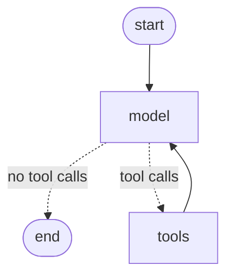

# L2-M1.1 — LangChain + LangGraph Agents

**Level:** AI Agents
**Duration:** 90 min

## Overview

Build the same ReAct agent twice — once with LangChain v1's `create_agent`, once
by hand as a LangGraph `StateGraph` — and compare what each one puts in an MLflow
trace. One `mlflow.langchain.autolog()` call instruments both, because
`create_agent` *returns* a compiled `StateGraph`: the two are the same object at
different levels of abstraction.

## Prerequisites

- Completed: L1-M2 (tracing), L1-M4 (evaluation)
- MLflow server running at <http://127.0.0.1:5555>
- LiteLLM gateway running at <http://localhost:4000> (`cd infra && podman compose up -d`)
- An `OPENROUTER_API_KEY` in the environment — the `gemma-large` alias routes there

## Concepts

### LangChain v1 agents are graphs, not chains

LCEL pipelines (`prompt | llm | parser`) are gone from the agent story. In
LangChain v1 an agent is `create_agent(model, tools, system_prompt)`, and what
comes back is a compiled LangGraph state machine. No chains appear anywhere in
this lesson.

### The ReAct loop

Both variants implement the same cycle:



The model node decides whether to answer or call a tool; the conditional edge
routes accordingly; the tool node executes and hands control back. That loop is
what `create_agent` builds for you.

### Why build it by hand at all

Because the trace shape differs. `create_agent` emits one `CHAIN` span for the
agent plus the model and tool spans underneath. The hand-built graph emits a span
per *node* — `model`, `route`, `tools` — so a routing bug is visible as a
transition in the trace instead of being inferred from message content. When an
agent loops or exits early, that is the difference between seeing the cause and
guessing at it.

### One gateway, one alias

Neither variant names a provider. Both call `gemma-large` on the LiteLLM gateway
from `infra/`, which starts on OpenRouter's free tier and falls back to the paid
model when free rate-limits or 404s. Changing model or provider is an edit to
`infra/litellm/config.yaml`, not to this lesson.

## Step-by-Step

### Step 1: Point the model at the gateway

```python
GATEWAY_URL = "http://localhost:4000/v1"
MODEL_ALIAS = "gemma-large"


def get_llm() -> ChatOpenAI:
    return ChatOpenAI(
        model=MODEL_ALIAS,
        base_url=GATEWAY_URL,
        api_key=SecretStr(GATEWAY_KEY),
        temperature=0.0,
    )
```

### Step 2: Enable autolog once, for both variants

```python
mlflow.langchain.autolog(log_traces=True)
```

### Step 3: Part 1 — the prebuilt agent

```python
agent = create_agent(
    model=get_llm(),
    tools=TOOLS,
    system_prompt=SYSTEM_PROMPT,
)
```

### Step 4: Part 2 — the same loop, hand-built

`add_messages` makes the `messages` key append rather than overwrite, and
`ToolNode` executes every tool call on the last message — the piece most often
hand-rolled and got subtly wrong.

```python
class AgentState(TypedDict):
    messages: Annotated[list, add_messages]


def route(state: AgentState) -> Literal["tools", "__end__"]:
    last = state["messages"][-1]
    return "tools" if getattr(last, "tool_calls", None) else "__end__"


builder = StateGraph(AgentState)
builder.add_node("model", call_model)
builder.add_node("tools", ToolNode(TOOLS))
builder.add_edge(START, "model")
builder.add_conditional_edges("model", route, {"tools": "tools", "__end__": END})
builder.add_edge("tools", "model")
graph = builder.compile()
```

### Step 5: Log the graph structure as an artifact

`draw_mermaid()` returns text, so it works offline — unlike `draw_mermaid_png()`,
which round-trips through mermaid.ink.

```python
mermaid = graph_agent.get_graph().draw_mermaid()
mlflow.log_text(f"# Hand-built agent graph\n\n```mermaid\n{mermaid}```\n", "graph.md")
```

## Running the Lesson

```bash
cd tutorial/level_2_agents/M1_agent_frameworks/1_langchain_langgraph
uv sync
uv run python main.py
```

## Expected Output

Six tasks run (three per variant), each resolving in one tool call and four
messages:

```text
  variant        task   tools   steps   latency
  ------------------------------------------------
  create_agent   1      1       4       3.02s
  create_agent   2      1       4       3.43s
  create_agent   3      1       4       4.63s
  state_graph    1      1       4       18.19s
  state_graph    2      1       4       14.00s
  state_graph    3      1       4       6.87s
```

Latency varies widely run to run — it is free-tier queueing at the provider, not
a property of either agent. Step and tool-call counts are the stable signal, and
they match: the two variants do the same work.

The trace analysis prints the span breakdown, where the hand-built graph's node
boundaries are visible:

```text
  Trace tr-9fc57b1240b83... — 9 spans, 6867ms
      [CHAIN] LangGraph (6867ms)
      [CHAIN] model (4065ms)
      [CHAT_MODEL] ChatOpenAI (4063ms)
      [CHAIN] route (0ms)
      [CHAIN] tools (2ms)
      [TOOL] word_counter (0ms)
      [CHAIN] model (2799ms)
      [CHAT_MODEL] ChatOpenAI (2797ms)
      [CHAIN] route (1ms)
```

In the MLflow UI under experiment **L2/M1_agent_frameworks/1_langchain_langgraph**:

- Two parent runs (`create_agent`, `state_graph`), each with three nested task runs
- A `variant_comparison` run holding `comparison.json` and the `graph.md` diagram
- Six traces on the Traces tab — open one and expand the span tree
- A separate `litellm-gateway` experiment with the gateway's own view of the same
  calls, including token counts and spend

## Key Takeaways

- LangChain v1 agents are LangGraph state machines; `create_agent` is a
  constructor for one, not a different kind of object.
- `mlflow.langchain.autolog()` covers both because there is only one runtime.
- The prebuilt agent hides node boundaries; the hand-built graph makes every
  state transition an inspectable span.
- `add_messages` and `ToolNode` are the two pieces worth not hand-rolling.
- Routing model choice through a gateway alias keeps provider changes out of
  lesson code.

## Next Steps

**L2-M1.2 — DeepAgents** moves from a single agent to an orchestrator that
delegates to sub-agents with isolated context windows, and shows what filesystem
backends change about agent state.
