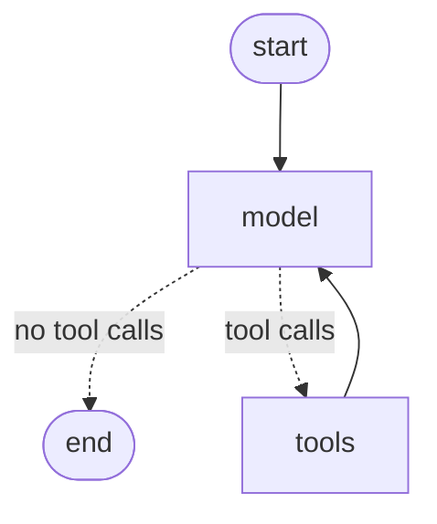

# L2-M1.1.1 — LangChain + LangGraph Agents

**Level:** AI Agents
**Duration:** 90 min

## Overview

Build one ReAct agent with LangChain v1's `create_agent`, run three tasks
through it, and read what `mlflow.langchain.autolog()` puts in the trace. What
`create_agent` returns is a compiled LangGraph `StateGraph` — so this lesson is
about LangChain *and* LangGraph, even though you never write a node by hand.

## Prerequisites

- Completed: L1-M2 (tracing), L1-M4 (evaluation)
- MLflow server running at <http://127.0.0.1:5555>
- MLflow AI Gateway seeded (`cd infra && podman compose up -d`) — it is the
  MLflow server itself, at <http://127.0.0.1:5555/gateway/mlflow/v1>
- Unsloth Studio running — the `gemma-agent` alias resolves there, and there is
  no fallback, so this lesson needs it
- Internet access for the graph image only (mermaid.ink). Without it the lesson
  still runs and logs the mermaid source instead

## Concepts

### LangChain v1 agents are graphs, not chains

LCEL pipelines (`prompt | llm | parser`) are gone from the agent story. In
LangChain v1 an agent is `create_agent(model, tools, system_prompt)`, and what
comes back is a compiled LangGraph state machine. No chains appear anywhere in
this lesson.

### The ReAct loop

`create_agent` builds this cycle for you:



The model node decides whether to answer or call a tool; the conditional edge
routes accordingly; the tool node executes and hands control back.

### You do not have to build the graph by hand

A common suggestion is to hand-roll the same loop with `StateGraph`, `ToolNode`
and `add_conditional_edges`, so the node boundaries show up in the trace. Run
this lesson and look at Part 2: the node boundaries are there already. Autolog
traces the compiled graph, so `model` and `tools` are separate `CHAIN` spans
whether or not you typed them yourself.

So the agent stays one object, built by one function.
`agent.get_graph().draw_mermaid_png()` draws the graph that `create_agent`
compiled, which is the honest way to see the state machine — it is the real one,
not a copy you rebuilt to look at.

### One gateway, one alias

The lesson names no provider. It calls `gemma-agent` on the MLflow AI Gateway
from `infra/`, which resolves to a local Unsloth model. There is no fallback, so
what the run says answered is what answered. Changing model or provider is an
edit to `infra/mlflow/gateway/seed_gateway.py`, not to this lesson.

## Step-by-Step

### Step 1: Point the model at the gateway

```python
GATEWAY_URL = "http://127.0.0.1:5555/gateway/mlflow/v1"
MODEL_ALIAS = "gemma-agent"


def get_llm() -> ChatOpenAI:
    return ChatOpenAI(
        model=MODEL_ALIAS,
        base_url=GATEWAY_URL,
        api_key=SecretStr(GATEWAY_KEY),
        temperature=0.0,
    )
```

### Step 2: Enable autolog once

```python
mlflow.langchain.autolog(log_traces=True)
```

One call covers the whole agent, because there is only one runtime underneath.

### Step 3: Build the agent

```python
def build_agent():
    return create_agent(
        model=get_llm(),
        tools=TOOLS,
        system_prompt=SYSTEM_PROMPT,
    )
```

`main()` calls this once and hands the agent to `run_tasks`, which logs its
graph and then runs every task through it.

### Step 4: Log a picture of the graph the agent compiled

This happens once, on the parent `create_agent` run, before any task runs. The
graph describes the agent, not one task, so logging it per task would say the
same thing three times.

**The MLflow UI has no mermaid renderer.** Log `draw_mermaid()` text in a `.md`
file and the UI shows you a code block, not a diagram. So render it to a PNG,
which the artifact viewer displays inline:

```python
png = agent.get_graph().draw_mermaid_png()

with tempfile.TemporaryDirectory() as tmp_dir:
    png_path = Path(tmp_dir) / "graph.png"
    png_path.write_bytes(png)
    mlflow.log_artifact(str(png_path))
```

`draw_mermaid_png()` renders through the **mermaid.ink** service, so it is the
one call in this lesson that leaves your machine. Everything else — the model,
the gateway, the tracking server — is local. If the service cannot be reached,
the lesson prints the reason and logs the mermaid source as `graph.md` instead:
a missing diagram must not take the whole run down.

### Step 5: Run the tasks

Each task gets a nested MLflow run with its latency, tool-call count and step
count. `state["messages"]` holds the full message list, so the counts come out
of the state, not out of the trace.

```python
state = agent.invoke({"messages": [{"role": "user", "content": task}]})
messages = state["messages"]
tool_calls = sum(1 for m in messages if m.type == "tool")
```

The parent run closes with the aggregates: `avg_latency`, `total_tool_calls`
and `total_steps`.

## Running the Lesson

```bash
cd tutorial/level_2_agents/M1_agent_frameworks/1_turn/1_langchain_langgraph
uv sync
uv run python main.py
```

## Expected Output

The graph image is logged first, then the three tasks — each resolving in one
tool call and four messages:

```text
  Graph image logged as graph.png (8388 bytes)

  Task 1: What is 15 * 23?
    Answer     : The result of 15 * 23 is 345.
    Tool calls : 1   Steps: 4   0.68s

  Task 2: Reverse the word 'MLflow'
    Answer     : wolfLM
    Tool calls : 1   Steps: 4   0.48s
```

Latency varies a lot run to run. If Unsloth has to load the model first, the
first task can take minutes. Step and tool-call counts are the stable signal.

The trace analysis prints the span breakdown, where the node boundaries of the
compiled graph are visible:

```text
  Trace tr-12c41d6619a41... — 7 spans, 813ms
      [CHAIN] LangGraph (814ms)
      [CHAIN] model (445ms)
      [CHAT_MODEL] ChatOpenAI (444ms)
      [CHAIN] tools (5ms)
      [TOOL] word_counter (1ms)
      [CHAIN] model (361ms)
      [CHAT_MODEL] ChatOpenAI (359ms)
```

Read it as one turn of the ReAct loop: the model asks for a tool, the tool runs,
the model answers with the result.

In the MLflow UI under experiment **L2/M1_agent_frameworks/1_turn/1_langchain_langgraph**:

- One parent run (`create_agent`) holding `graph.png` and the aggregate metrics,
  with three nested task runs under it. Open the **Artifacts** tab and the
  diagram is displayed, not downloaded
- Three traces on the Traces tab — open one and expand the span tree

## Key Takeaways

- LangChain v1 agents are LangGraph state machines; `create_agent` is a
  constructor for one, not a different kind of object.
- One `mlflow.langchain.autolog()` call instruments the whole agent, node spans
  included — you do not have to hand-build the graph to see them.
- `agent.get_graph().draw_mermaid_png()` shows the real compiled state machine,
  not a copy you redrew by hand. The MLflow UI cannot render mermaid text, so
  log the picture.
- Message-level counts (tool calls, steps) come from the returned state; timing
  and structure come from the trace.
- Routing model choice through a gateway alias keeps provider changes out of
  lesson code.

## Next Steps

**L2-M1.1.2 — DeepAgents** moves from a single agent to an orchestrator that
delegates to sub-agents with isolated context windows, and shows what filesystem
backends change about agent state.
