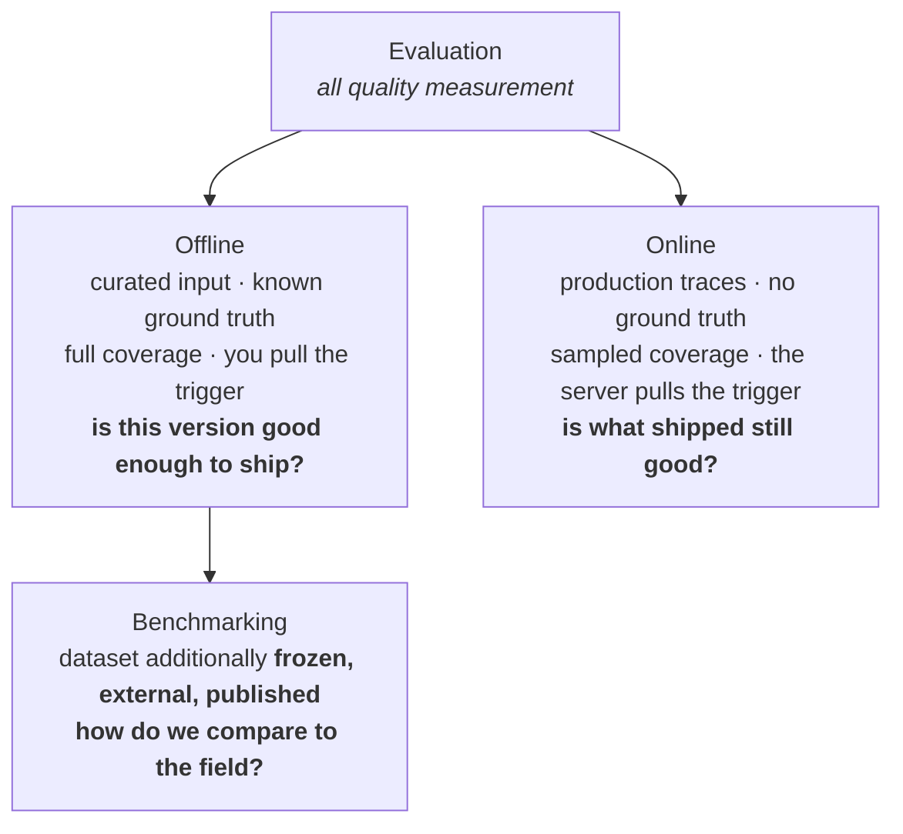

# Level 2 — AI Agents

Everything about building, observing, evaluating and benchmarking AI agents with
MLflow. Assumes Level 1: tracking, tracing, evaluation and prompt management are
not re-taught here.

| Module | What it covers | Lessons |
|:--|:--|--:|
| M1 — Agent Frameworks | LangChain/LangGraph, DeepAgents, Claude Agent SDK, and tracing each of them | 3 |
| M2 — Agent Evaluation | Three groups: instruments, offline (including benchmarks), online | 9 |
| M3 — Agent Optimization | Instructions, agent configuration, and optimizing against benchmarks safely | 3 |

The full lesson breakdown lives in [`syllabus.md`](../../syllabus.md) at the
project root, which is the source of truth for structure and ordering.

> **Directory layout is mid-migration.** The syllabus above describes the target
> structure. On disk the lessons are still in their previous flat layout
> (`M2_agent_evaluation/1_agent_testing/` … `M3_agent_benchmarks/`) until the
> move is carried out. The concepts below are unaffected.

## Evaluation and benchmarking — the distinction this level is built on

These two words are used interchangeably almost everywhere, and the confusion is
understandable: **every benchmark run is an evaluation.** The reverse is not
true, and that asymmetry is the whole distinction.

Benchmarking is a *special case* of evaluation. What promotes an ordinary
evaluation into a benchmark is one property:

> The dataset and the metric are **frozen and externally owned**, so the number
> means something to someone outside your team.

That gives you a single question to settle any case. *Would this number still be
meaningful to a stranger?* If yes, it is a benchmark. If it only means something
relative to your own previous run, it is an evaluation.

### Six tests, in order of reliability

| Ask | Evaluation | Benchmark |
|:--|:--|:--|
| Who owns the dataset? | you wrote it, or it came from your production traces | a published, frozen artifact (SWE-Bench Verified, GAIA) |
| What is the number compared to? | your own baseline, or a threshold you picked | other people's systems — a leaderboard |
| Can you re-weight the metric? | yes, it is yours to tune | no, the metric is part of the benchmark's contract |
| How is scoring computed? | often an LLM judge, because questions are open-ended | deterministic — exact match, test execution |
| What decision does it drive? | ship / do not ship, which variant, is production healthy | a capability claim, position against the field |
| How often does it run? | every pull request, plus continuously online | rarely — it is slow and expensive |

The third test is the one most often missed. In **M2.1.3** you build composite
scorers with explicit, tunable weights, and tuning them is a legitimate act. In
**M2.2.3** an instance counts as `resolved` only when every `FAIL_TO_PASS` test
passes and no `PASS_TO_PASS` test regresses. Re-weight that and your number
quietly stops being a SWE-Bench score.

The fourth test has a consequence worth stating early: **a benchmark you optimize
against stops being a measurement.** Optimizing on benchmark data is legitimate
only when the benchmark hands you a split you never report on. GAIA does —
`validation` answers are public, `test` answers are withheld for the leaderboard.
SWE-Bench Verified does not: its `test` split ships the gold patches and the test
lists openly, so there is no clean half left to tune against. M3.3 is the lesson
that deals with this directly.

### The relationship, drawn

Benchmarking sits *inside* offline evaluation. It is not a third thing beside it.



Two consequences fall out of the shape:

- **Benchmarking is always offline.** This is why "online benchmark" sounds
  wrong while "online evaluation" does not. A benchmark needs fixed inputs and
  ground truth; production traffic has neither.
- **Comparing systems does not make something a benchmark.** M2.2.1 compares
  three or more agent architectures against each other, which sounds
  benchmark-shaped. It is not: the dataset is yours, the judge is your registered
  judge at a specific version, and nobody outside your organisation can reproduce
  or interpret the result. Comparing systems *on a shared external artifact* is
  what makes a benchmark.

### Offline and online — the other axis

Within evaluation, the second distinction cuts a different way, and it is what
the M2 groups are named after. Four axes separate the two modes:

| | offline | online |
|:--|:--|:--|
| **input** | curated dataset | production traces |
| **ground truth** | expectations | none |
| **coverage** | every case | sampled, because each judge call costs a model call |
| **trigger** | you, in CI | the server, on a schedule |

Neither replaces the other. Offline evaluation cannot tell you that real users
ask things your dataset never imagined; online scoring cannot tell you whether a
change is safe *before* you ship it.

Note that this axis classifies **the act of evaluating**, not the materials —
which is exactly why M2 has a third group. A dataset is offline by nature: online
traffic has no expected answers to compare against. A *judge* is not — the
registered judge is the one instrument both modes consume, scoring a curated
dataset offline in M2.2.1 and live sampled traces online in M2.3.1. Registration
is what makes that possible: an inline `@scorer` is `DECORATOR` kind, cannot be
registered against a local tracking server, and therefore can never run online.
That is the practical reason M2.1.2 spends a whole lesson on the difference
between inline and registered judges, and why datasets, judges and metrics live
in **Instruments** rather than under either mode.

## How the modules map onto all of this

```text
M1  Agent Frameworks          build the thing, and make it observable
M2  Agent Evaluation          measure it
    M2.1  Instruments           the materials both modes consume
      M2.1.1  agent testing       the dataset
      M2.1.2  judges              the graders
      M2.1.3  quality metrics     the dimensions
    M2.2  Offline                 "good enough to ship?"
      M2.2.1  comparison          against your own bar: which architecture wins
      M2.2.2  offline gates       against your own bar: CI, thresholds, regressions
      M2.2.3  SWE-Bench           against everyone else's bar
      M2.2.4  GAIA                against everyone else's bar
      M2.2.5  custom benchmark    build a bar others can use
    M2.3  Online                  "is what shipped still good?"
      M2.3.1  online scoring      registered judge, sampled live traces
M3  Agent Optimization        change it, and re-measure
```

Benchmarking sits inside **Offline** because that is what it is — the taxonomy
wins over the mechanics. Be aware the mechanics genuinely differ, though: the
first two offline lessons are built on `mlflow.genai` (`evaluate()`, scorers,
judges, datasets), while the three benchmark lessons call none of it. They are
hand-built harnesses using plain `mlflow.start_run()` and `log_metrics()`, and
they need infrastructure the rest of M2 never touches — containers and `git diff`
capture for SWE-Bench, gated HuggingFace datasets for GAIA, and real API spend
rather than the local gateway. MLflow ships an evaluation framework and
deliberately does not ship a benchmarking framework, because a benchmark harness
is inseparable from its benchmark.

**M3 is not evaluation.** Optimization consumes an evaluation and emits a changed
system, which is a different verb: `optimize_prompts(..., scorers=[...])` takes a
scorer as an *input*. That dependency is also why it comes last — you cannot
optimize what you cannot measure.

## One caveat on the word "benchmark"

It carries three distinct meanings in this space, and MLflow's own documentation
uses at least two of them:

1. **Capability benchmark** — SWE-Bench, GAIA. What M2.2 means by the word.
2. **Systems/performance benchmark** — throughput and latency overhead, as in
   MLflow's AI Gateway performance documentation. Nothing to do with quality.
3. **Loose synonym for evaluation** — common in papers and blog posts.

When you read "we benchmarked our agent", check which one is meant before
comparing it to anything.

## Next

Start with [M1 — Agent Frameworks](M1_agent_frameworks/) if you have finished
Level 1. Level 3 picks up where M2.3.1 leaves off: the online assessments
produced there become the dashboards, alerts and quality gates of
[Level 3](../level_3_advanced/).
